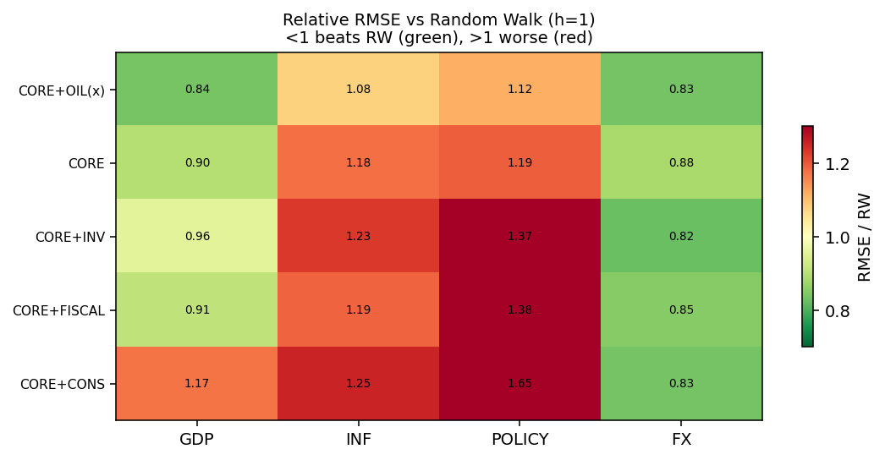

# Macro VAR Research Lab

Three completed studies on US quarterly macro data, one question: what actually forecasts the
macroeconomy out of sample once leakage, overfitting and multiple comparisons are controlled? The
answer across 1,000+ specifications, five estimator classes, externally identified shocks, and a
real-time replication is consistently modest, and the lab reports it that way.

Nicholas Hong · Nanyang Technological University

| Study | Paper | Headline |
|---|---|---|
| **1. Disciplined specification search and model-class evaluation** (repository root) | [`papers/01_var_selection_horserace.pdf`](papers/01_var_selection_horserace.pdf) | A theory-pruned block forward search with hard validity gates selects a four-variable core plus oil as the honest baseline; **no estimator — OLS, Minnesota BVAR, ridge, LASSO, elastic-net — is distinguishable from a univariate AR by the Model Confidence Set.** Full-sample HP filtering of the policy rate leaks the future by 66% of the cycle's own standard deviation at the endpoint; year-over-year transforms fail every whiteness test. |
| **2. BVAR with constructed shocks: density forecasting done carefully** (`studies/bvar_shocks_density/`) | [`studies/bvar_shocks_density/paper/US_VAR_IEEE_paper.pdf`](studies/bvar_shocks_density/paper/US_VAR_IEEE_paper.pdf) | A naively coded Minnesota prior leaves the posterior unshrunk (largest companion eigenvalue 1.068); dummy observations restore stability (0.96). Stacking all shocks inflates OOS error by an order of magnitude; look-ahead in standardised shocks flatters skill; a 13-quarter window has no power. An expanding-window evaluation (48 origins) scored by CRPS and log score shows a **stochastic-volatility BVAR beats random-walk and AR(1) densities for output and inflation**, with the long rate still hard to beat. |
| **3. A permutation study of VARX forecasting models** (`studies/varx_permutation_study/`) | [`studies/varx_permutation_study/paper/varx_permutation_study.pdf`](studies/varx_permutation_study/paper/varx_permutation_study.pdf) | 1,632 specification cells / 1,014 unique models in an expanding walk-forward from 2009Q4. Exogenous shocks buy a ~12% GDP RMSE gain at h=1 that is **mostly COVID and mostly noise** (4.0% of specs beat the core at the 5% level, what chance delivers); the gain survives ALFRED real-time vintages; **externally identified shocks (Kaenzig oil, Bauer-Swanson FOMC) do not beat cheap growth-rate proxies**; in the predictive density the shock model is overconfident until future-shock risk is priced, after which it is no sharper than the pure VAR. |

All data are public and keyless (FRED, FRBSF, NY Fed HLW, ALFRED); every study ships its results
tables and figures and can be re-executed.



---

## Study 1 — specification horse race (root)

```
src/            forward-selection runners (base, all-YoY, augmented, REER-YoY, gap-vs-level),
                phase-2 model-class comparison, BVAR (Minnesota + sum-of-coefficients), FAVAR,
                ML shrinkage models, evaluation (Clark-West, Diebold-Mariano, MCS), figure builder,
                reproduce.py (single-seed driver that regenerates every number in the paper)
results/        executed outputs for all five specifications + phase 2 + reproduce_results.json
figs/           relative-RMSE heatmaps, winner forecasts, HP look-ahead, gap-vs-level
docs/           methodology note
papers/var_selection_horserace/   LaTeX source and figures
```

Every runner resolves its paths from its own file location, so they work from any working
directory (override the root with `REPRO_ROOT`). Re-runs write to `fred_data/`, `repro/` and
`outputs/` — all gitignored — so nothing regenerated ever overwrites the committed tables in
`results/`, the charts in `figs/`, or the typeset figures in `papers/var_selection_horserace/figs/`.
`src/reproduce.py` puts its three paper figures in `outputs/figs/`.

Re-run everything:

```
pip install -r requirements.txt
python src/reproduce.py            # pulls FRED + FRBSF TFP if not cached in fred_data/, seed 20260710
```

**Which number is the result.** The greedy forward path, *before* the validity gates are applied,
runs 1.0431 (`CORE`) → 0.9452 (`CORE+WEALTH`) → 0.9117 (`CORE+WEALTH+OIL(x)`) in mean relative RMSE
at h=1. Neither wealth specification is admissible: `CORE+WEALTH` fails the parsimony gate
(T/k = 2.29) and `CORE+WEALTH+OIL(x)` fails both parsimony (T/k = 2.10) and residual whiteness
(p = 0.044). The **eligible winner — the specification used throughout the paper — is `CORE+OIL(x)`
at 0.9679 (h=1) and 0.8786 (h=4)**. The rejected 0.9117 is reported precisely *because* it is the
best raw score in the run: it is the case that demonstrates the hard filters overruling
out-of-sample RMSE, which is the point of Study 1. Full per-specification detail is in
`results/reproduce_results.json` (`phaseA_table`).

Re-executed on 2026-08-21 against a fresh FRED pull: the specification search (eligible winner
`CORE+OIL(x)`, and the same greedy path and gate rejections above) and the model-class table
reproduce identically; the HP
revision statistic (66.3% vs 65.8%) and the Johansen trace move in the second decimal because the
reference run used a frozen 2026-07-10 FRED vintage and later vintages carry data revisions. `results/reproduce_results.json`
records the library versions of the reference run (numpy 2.4.4, pandas 3.0.2, statsmodels 0.14.6,
scikit-learn 1.8.0, arch 8.0.0); those exact pins are in `requirements-reference.txt`, so
`pip install -r requirements-reference.txt` rebuilds the reference environment. `requirements.txt`
is the loose everyday set.

## Study 2 — BVAR + shocks density study

`studies/bvar_shocks_density/README.md` for the method, results tables (`eval_multi_us.csv`,
`panel_metrics.csv`, `rolling_density_eval.csv`), the stochastic-volatility path of GDP-growth
shocks, and the G7 extension. The six shock inputs are constructed from public series (WTI,
S&P 100, PCE, PFI, nonfinancial debt, CBO primary balance); see its `DATA.md`.

## Study 3 — VARX permutation study

`studies/varx_permutation_study/README.md`. Self-contained: `fetch_data.py` then `run_study.py`
reproduces the full walk-forward in well under a minute; the extensions (real-time, identified
shocks, combination, density, Bayesian coverage) run in seconds against cached data. A
self-contained interactive console is in `dashboard/dashboard.html`. Re-executed end-to-end on
2026-08-21 (1,014 models, 38 s; all 31 paper statistics identical) and again on 2026-08-23
(1,014 models, 63,918 result rows, 36 s).

## What the three studies agree on

1. Parsimony and leakage-free evaluation dominate estimator sophistication in short macro samples.
2. Reduced-form forecasting does not reward structural identification; cheap proxies are the right
   instrument for that job.
3. Honest nulls are the product. Every number here was reported as it came out.

---

Nicholas Hong | Built for educational and research purposes. Not financial advice.
