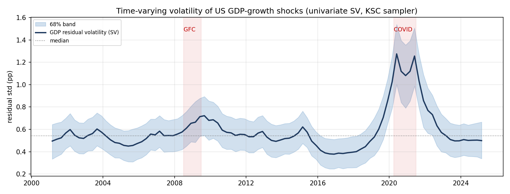

# Study 2 — BVAR with constructed exogenous shocks: a density-forecasting study

Paper: [`paper/US_VAR_IEEE_paper.pdf`](paper/US_VAR_IEEE_paper.pdf) (LaTeX source alongside it
in `paper/`).
Typeset 2026-08-23 from the corrected source (author block fixed; no content changes).

## Question

Bayesian VARs augmented with constructed exogenous shocks are widely used for macro forecasting,
yet the safeguards needed to interpret them are often missing. Using five quarterly US series
(real GDP growth, CPI inflation, REER, 10-year yield, policy rate; 2000Q1–2025Q1, T = 101) and
six constructed shocks (oil, equity wealth, consumption, investment, credit impulse, fiscal
impulse), the study builds a reproducible pipeline that exposes and corrects the common failures.

## Findings

- A naively coded Minnesota prior can leave the posterior effectively unshrunk: largest companion
  eigenvalue **1.068** (explosive). A natural-conjugate Minnesota prior via dummy observations
  restores stability (**0.96**) and bounded forecasts.
- Stacking all available shocks inflates out-of-sample error by an order of magnitude relative to a
  no-shock baseline.
- Look-ahead leakage in standardised shock construction flatters apparent skill.
- A static 13-quarter evaluation window has no power to discriminate models; it is replaced by an
  expanding-window evaluation over 48 origins.
- Scored by CRPS, log score and Diebold-Mariano tests, a **stochastic-volatility BVAR produces
  sharper, better-calibrated predictive densities than random-walk and AR(1) benchmarks for output
  growth and inflation**; the long-rate block remains hard to beat.
- Johansen testing returns full cointegration rank, justifying estimation in levels; the COVID-19
  variance spike is concentrated in output, motivating variable-specific volatility.



## Files

```
src/shock_builder.py     AR(1)-surprise shock construction, z-scored on the training window only
src/var_advanced.py      Minnesota BVAR (naive vs dummy-observation), stability diagnostics
src/sv_univariate.py     univariate stochastic-volatility sampler (KSC mixture)
src/var_addons.py        Johansen, structural identification, local projections
src/eval_multi.py        expanding-window density evaluation (RMSE, CRPS, log score)
src/panel.py             G7 panel evaluation
src/fetch_g7.py          FRED pulls for the G7 extension
results/                 eval_multi_us.csv, panel_metrics.csv, rolling_density_eval.csv,
                         gdp_sv_path.csv, benchmark_REAL_final.csv
figures/                 fig_crps.pdf, fig_lp.pdf, fig_panel.pdf, fig_sv.pdf, gdp_sv_path.png
notebooks/               US_VAR_addons.ipynb
docs/                    methodology review
paper/                   US_VAR_IEEE_paper.pdf, US_VAR_IEEE_paper.tex, IEEEtran.cls
```

## Building the paper

Run from `paper/`:

```bash
mkdir -p build
printf '%s\n' '\AddToHook{class/IEEEtran/after}{\RequirePackage[OT1]{fontenc}}' \
  '\input{US_VAR_IEEE_paper.tex}' | tectonic -X compile - -o build
```

Tectonic is XeTeX-based and IEEEtran's Times (`ptm`) family is undefined under XeTeX's
default TU encoding, so without the `[OT1]{fontenc}` wrapper tectonic silently substitutes
Latin Modern and reflows the whole paper; the wrapper is what reproduces the Times
typesetting of the committed PDF. Because the source arrives on stdin the result is written
as `build/texput.pdf`. pdfTeX needs none of this — `pdflatex US_VAR_IEEE_paper.tex` builds the
source as-is.

## Data

See [`DATA.md`](DATA.md). The endogenous block and the G7 panel are pulled from FRED
(`fetch_g7.py`). The shock inputs are public series (WTI spot, S&P 100, PCE quantity index,
private fixed investment, domestic nonfinancial debt, CBO cyclically adjusted primary balance);
the spreadsheet exports used in the original run are not redistributed, and `DATA.md` lists the
series to rebuild them.
